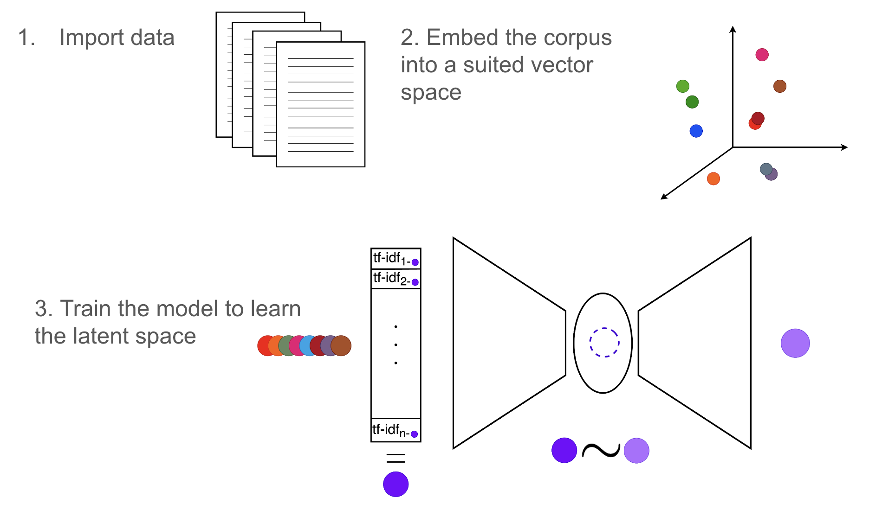
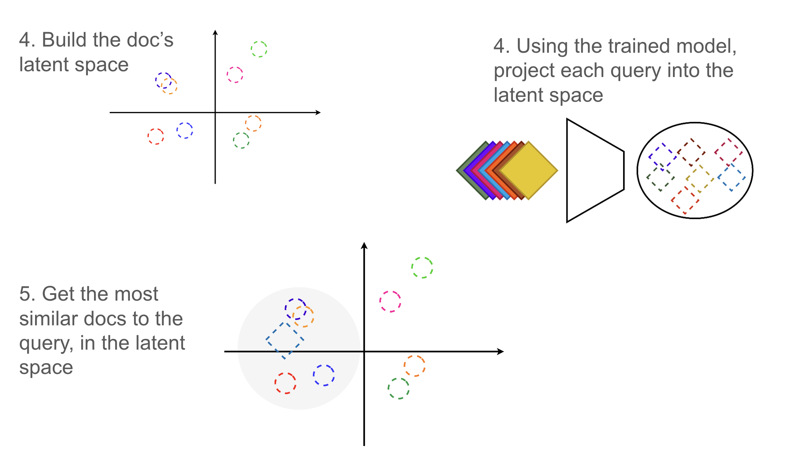
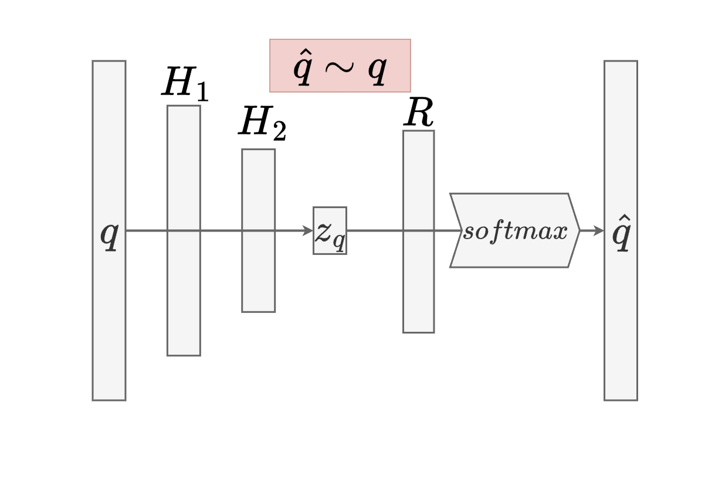
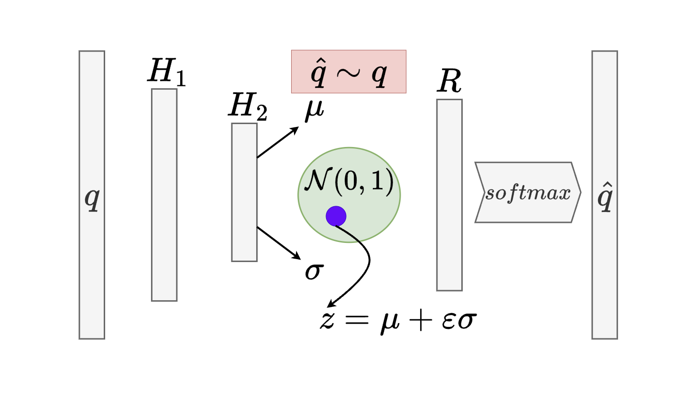

# Latent Semantic Analysis
Repository for the project of Information Retrieval @ University of Trieste held by professor Laura Nenzi, DSSC Course, A.Y. 2023/2024.

## Outline of the project
This project aims to implement different models for Latent Semantic Analysis (LSA) using deep neural networks and SVD techniques and compare their performances. The goal of the assessment is to evaluate the quality of the learned latent space. The following papers are taken as starting points to implement the code:
- [Neural Variational Inference for Text Processing](https://arxiv.org/abs/1511.06038)
- [Unsupervised Neural Generative Semantic Hashing](https://arxiv.org/abs/1906.00671)
- [Semantic Hashing](https://www.sciencedirect.com/science/article/pii/S0888613X08001813)

Two deep architectures are implemented: see [here](#autoencoder) and [here](#variationalautoencoder) for details.

## Dataset
The datasets used can be distinguished into two different categories.
- datasets inside [data](./data/) folder are small datasets, which comprise:
    - corpus of documents/articles (`.ALL` file)
    - a set of provided queries (`.QRY` file)
    - for each query, the corresponding relevance judgments (`.REL` file)
- [20newsgroup](http://qwone.com/~jason/20Newsgroups/) dataset, a large dataset consisting of 20000 articles divided into 20 different topics. The dataset is already divided into training and test sets but does not contain queries and relevance judgments, hence the assessment is performed with different techniques.

## Structure of the repository
- [data](./data/) folder contains the following dataset:
    - time dataset (423 documents, 83 queries)
    - cran dataset (1398 documents, 225 queries)
    - med dataset (1033 documents, 29 queries)
- [src](./src/) folder contains the source code:
    - [autoencoder.py*](./src/autoencoder.py) implementation from scratch of autoencoder architecture
    - [variational_autoencoder.py*](./src/variational_autoencoder.py) implementation from scratch of variational autoencoder architecture
    - [IR class*](./src/IR.py) implementation of a python class from scratch useful for the analysis
    - [import_dataset.py*](./src/import_dataset.py) code for read and import data stored inside [data](./data/) folder.
    - [pipelines.py*](./src/pipelines.py) implementation of two pipelines for the analysis of the two different categories of dataset.
    - [utils.py*](./src/utils.py) code for the implementation of some useful functions.
    - [_embeddings.py**](./src/_embeddings.py) code for the implementation from scratch of the inverted index, the tfidf, and word-count matrices.

- [out](./out/) folder contains `.txt` outputs from the analysis done on [data](./data/).
- [data_analysis](./data_analysis.ipynb) notebook for the analysis of the [data](./data/)'s datasets.
- [20news_analysis](./20news_analysis.ipynb) notebook for the analysis of the [20newsgroup](http://qwone.com/~jason/20Newsgroups/) dataset.

`*`: for further details, see the specific documentation provided for each function.

`**`: the code is working but not directly employed for efficiency reasons.

## Procedure for [data](./data/) analysis
The following pipeline is followed to perform the analysis:
1. Import the data.
2. Build the embedding matrix of the corpus, with both word count and tfidf embeddings.

3. For each model: SVD, AutoEncoder, VariationalAutoeEncoder:
    - build the latent space using the embedding matrix of the corpus (if the model is a NN, train the model)
    - project each query into the latent space and compute its similarity with all the documents in the latent space
    - get the top k similar documents to each query
    - compute the precision and recall using the relevance

A simplified step-by-step version of the procedure is shown in the following figures:

## Procedure for [20newsgroup](http://qwone.com/~jason/20Newsgroups/) analysis
The following pipeline is followed to perform the analysis:
1. Import the data
2. Use a CountVectorizer to build the bag of words matrix of the training data
3. Build the trainlaoder using the embedded training data
4. Train an AutoEncoder model using the trainloader
5. Build the latent space using the training data
6. For each document in the test set:
    - compute its latent representation
    - compute the cosine similarity between the latent representation and the training documents
    - retrieve the top k documents with the highest similarity and the k nearest neighbors
    - compare the labels of the retrieved documents with the label of the test document
    - compute the precision for both methods
7. Average the precision over all the test documents

## Results
In this section are reported the results obtained from the analysis of the different datasets.

### [20newsgroup](http://qwone.com/~jason/20Newsgroups/) dataset
The following table reports the results obtained from the analysis of the [20newsgroup](http://qwone.com/~jason/20Newsgroups/) dataset. The model used is the AutoEncoder, trained on a word-count embedding matrix of the training data.
It was tested with an increasing number of classes, and with different latent dimensions (50 and 200). Then, cosine similarity and nearest neighbors were used to retrieve the documents and compared following steps 6-7 of this [procedure](#procedure-for-20newsgroup-analysis).

|# classess        |latent dimension         | Accuracy cosine similarity   | Accuracy nearest neighbours|
|------------------|-------------------------|------------------------------|----------------------------|
|2            |50                        |    85%        | 83% |
|2            |200                       |       94%     |   93%  |
|4            |50                       |       54%     |   26% | 
|4            |200                       |      67%      |  59% |
|6            |50                       |       47%     |  17% | 
|6            |200                       |      54%      | 40% |
|8            |50                       |      50%     |  45%   |
|8            |200                       |        52%    | 40%|

### Datasets in [data](./data/)
The following table reports the results obtained from the analysis of the datasets in [data](./data/), following [this](#procedure-for-data-analysis). The models used were SVD, the AutoEncoder, and the VariationalAutoEncoder.
Both word count and tfidf embeddings were tested for each model, and the results are reported in the table below.
The percentage % represents the percentage of queries within the .QRY file that has at least one relevant document in the top 15 retrieved documents. The precision P and recall R are computed on the top 15 retrieved documents. $\ell$ is the average loss computed for AE and VAE.

|           |SVD        |AE         |VAE         |
|-----------|-----------|-----------|------------|
|TIME - WC|83%, P: 15%, R: 65%|71%, P: 13%, R: 49%, $\ell$=0.095|20%, P: 1.2%, R: 7%, $\ell$=0.113|
|TIME - TFIDF|85%, P: 18%, R: 72%|58%, P: 8%, R: 32%, $\ell$=0.0019|1%, P: 0.6%, R:2.3%, $\ell$=0.003|
|CRAN - WC|66%, P: 9%, R: 19%|52%, P: 5%, R: 12%, $\ell$=0.009|7%, P: 0.05%, R: 1%, $\ell$=0.011|
|CRAN - TFIDF|73%, P: 12%, R: 25%|38%, P: 4%, R: 7%, $\ell$=0.016|11%, P: 0.07%, R: 1.3%, $\ell$=0.017|
|MED - WC|93%, P: 50%, R: 35%|93%, P: 42%, R: 29%, $\ell$=0.42|17%, P: 1%, R: 1%, $\ell$=0.43|
|MED - TFIDF|96%, P: 68%, R: 48%|96%, P: 42%, R: 30%, $\ell$=0.11|38%, P: 3%, R: 2%, $\ell$=0.12|

## AutoEncoder and VariationalAutoEncoder latent space
Many architectures were recently developed to learn a latent representation of a document. In this project, I used two simple architectures: the AutoEncoder and the VariationalAutoEncoder.

### AutoEncoder
The idea behind the AutoEncoder is to learn a deterministic latent representation of the document, by encoding it into a lower dimensional space, and then decoding it back to the original space. 
The encoding is done using two hidden linear layers, with reLU activation function. Note that the latent space is the output of the encoder.
The decoding is done using one linear layer, then a Softmax layer: this is useful to obtain a probability distribution over the vocabulary space, based on the latent representation of the document.

The training is done by minimizing the loss function, which is the cross entropy between the original document and the decoded one, as depicted in the following figure.

### VariationalAutoEncoder
The VariationalAutoEncoder is a more complex architecture. 
In this context, we don't learn a deterministc latent space, but a probabilistic one. 
During the training, we learn an inference model parametrized by the encoder neural network which outputs the parameters of the unknown probability distribution $p(z|q)$. Then, we sample from this distribution to obtain the latent representation of the document.

The generative model (or decoder network) is then used to reconstruct the document from its latent representation.
The training is done by minimizing the loss function, which is the sum of the cross entropy between the original document and the decoded one, and the KL divergence between the inference model and the prior distribution, as depicted in the following figure.

For further reading, see [this](https://arxiv.org/abs/1312.6114) paper.
